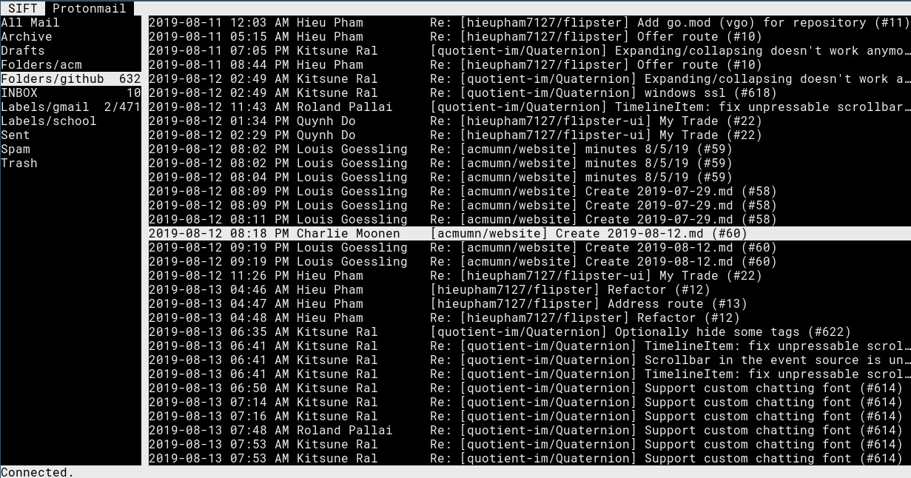

+++
title = "command line email with aerc"
date = 2020-05-04
insert_anchor_links = "left"
draft = true

[taxonomies]
tags = ["setup", "email", "protonmail"]

[extra]
include_posts = true
toc = true
+++

I just set up command line email with my new work account and my [ProtonMail][1] account today! This article will be covering the full setup.



## setting up proton-bridge

ProtonMail is an email service that end-to-end encrypts its users' emails with PGP. As a result, it doesn't speak SMTP or IMAP directly, since email clients wouldn't know how to undo the encryption anyway. That's why they've provided [proton-bridge][2], a ([now][3]) open-source SMTP/IMAP server that translates their own API calls into SMTP/IMAP for your email clients. For security, it's  best to run this locally, so that emails aren't exposed over the network after they're decrypted.

For my setup, I have proton-bridge running as a systemd service. That means we have to deal with any interactive parts of the service so they're not popping up anymore.

Firstly, we want to build the bridge without support for the GUI. We won't be using it anyway, so this eliminates the Qt dependency.

Secondly, proton-bridge stores keys in an encrypted keyring, like password-store. My regular password-store is encrypted with my passphrase-protected GPG key, so I didn't want to use it since it'll be asking me for the passphrase again every time the timeout expires. We're going to make a separate GPG and password-store setup that will only be used for proton-bridge. Since it's all running locally anyway, we're _not_ to use a passphrase on this GPG key.

Authenticating only happens once, and the local SMTP/IMAP password doesn't change very often, so we won't really care about that. We'll bundle this up into a couple of nice scripts and then have it configured to start on startup!

### building proton-bridge

To build proton-bridge without the GUI, we'll need to grab a copy of the [source][2]. Clone the repo and then change directory to it:

```bash
git clone https://github.com/protonmail/proton-bridge
cd proton-bridge
```

As of now, there's no tagged releases, so let's just build straight from master. Peeking into the Makefile, there isn't a release build for the nogui option, so let's add it ourselves. Put this somewhere in the Makefile:

```make
build-nogui:
    PROTONMAIL_ENV= go build ${BUILD_FLAGS_NOGUI} ./cmd/Desktop-Bridge
```

Then run `make build-nogui` and you should get a binary called `Desktop-Bridge`. Don't authenticate just quite yet; we want to set up the keychain first so it stores it in the right place.

### isolating the keychain

So for this section, I created two directories: the directory for the new GPG homedir, and the directory for the new password-store. If you're copy-pasting commands out of this post, I'd recommend you add these variables right now:

```bash
export PASSWORD_STORE_DIR=/path/to/password/store
export GNUPGHOME=/path/to/gpg/home
```

...obviously replacing the paths with paths that you choose. These variables are used by `pass` and `gpg` to overwrite the default directories they use, so it's important to set them up. The next step is to make sure they both exist:

```bash
mkdir -p $PASSWORD_STORE_DIR $GNUPGHOME
```

Now initialize the GPG key first. Run:

```bash
gpg --full-generate-key
```

There should be an interactive prompt. Go through and answer the questions however you see fit. I'd recommend you make the key 4096 bits, never expire, and have no passphrase. This key should never leave your local machine, and you will almost never use it directly, so there should be no problem.

Then, set up password-store. Run:

```bash
pass init [gpg-id]
```

where `[gpg-id]` is some identifier for the key you just created (name or email works).

At this point, you should test your configuration by running the `Desktop-Bridge` program with the `-c` option to open the prompt. Make sure you are able to log in and that rerunning the program should automatically run the bridge using the authenticated user without any interactive prompts.

```
            Welcome to ProtonMail Bridge interactive shell
                              ___....___
    ^^                __..-:'':__:..:__:'':-..__
                  _.-:__:.-:'':  :  :  :'':-.:__:-._
                .':.-:  :  :  :  :  :  :  :  :  :._:'.
             _ :.':  :  :  :  :  :  :  :  :  :  :  :'.: _
            [ ]:  :  :  :  :  :  :  :  :  :  :  :  :  :[ ]
            [ ]:  :  :  :  :  :  :  :  :  :  :  :  :  :[ ]
   :::::::::[ ]:__:__:__:__:__:__:__:__:__:__:__:__:__:[ ]:::::::::::
   !!!!!!!!![ ]!!!!!!!!!!!!!!!!!!!!!!!!!!!!!!!!!!!!!!!![ ]!!!!!!!!!!!
   ^^^^^^^^^[ ]^^^^^^^^^^^^^^^^^^^^^^^^^^^^^^^^^^^^^^^^[ ]^^^^^^^^^^^
            [ ]                                        [ ]
            [ ]                                        [ ]
      jgs   [ ]                                        [ ]
    ~~^_~^~/   \~^-~^~ _~^-~_^~-^~_^~~-^~_~^~-~_~-^~_^/   \~^ ~~_ ^
>>> login
Username: iptq
Password:
Authenticating ...
Adding account ...
```

### automating the whole process

Now that the bridge is able to run independently, let's make a tiny wrapper script called `run-proton-bridge.sh` that calls it using the appropriate environment variables:

```bash
#!/bin/bash

# same as before
export PASSWORD_STORE_DIR=/path/to/password/store
export GNUPGHOME=/path/to/gpg/home

exec /path/to/Desktop-Bridge $@
```

Save this somewhere, give it executable permissions.

Finally, we can add a systemd service that runs this whole business whenever the network is available. I'd recommend adding this as a user service rather than a system service. You can put this somewhere like `$HOME/.config/systemd/user/proton-bridge.service`:

```systemd
[Unit]
After=network.target

[Service]
Restart=always
ExecStart=/path/to/run-proton-bridge.sh

[Install]
WantedBy=default.target
```

Run this service:

```
systemctl --user start proton-bridge
```

Enable it to have it auto-start:

```
systemctl --user enable proton-bridge
```

Bridge configuration should be complete at this point, so let's move on to configuring our mail client to work with it.

## setting up aerc

[aerc][4] is a new (**work-in-progress**) command-line mail client by Drew Devault. It features a familiar set of default keybinds, calls out to your favorite editor for composition, and DWIM for many other things. I just started using it today and had no problem getting used to the interface.

The setup for basic SMTP/IMAP email accounts is actually pretty trivial. When you run aerc for the first time, or whenever you run the command `:new-account`, an interactive screen is brought up prompting you for the details about your mailbox. If your mail provider doesn't work immediately, jump into `#aerc` on freenode; the folks there are super helpful with different mail providers.

### setting up aerc.. _with_ protonmail

If you've been keeping up, then all the pieces should be in place for aerc to work with ProtonMail. There's just a tiny bit of glue we have to add to put it all together.

**aerc does not allow untrusted certificates**. Since proton-bridge generates a self-signed cert, we'll need to trust this cert before we can do anything. There's not really an easy way to pull the certificate out, so I'd recommend just firing up the bridge and then connecting to it using the openssl client and then copy-pasting the certificate part:

```
$ openssl s_client -starttls imap -connect 127.0.0.1:1143 -showcerts
CONNECTED(00000003)
Can't use SSL_get_servername
depth=0 C = CH, O = Proton Technologies AG, OU = ProtonMail, CN = 127.0.0.1
verify return:1
---
Certificate chain
 0 s:C = CH, O = Proton Technologies AG, OU = ProtonMail, CN = 127.0.0.1
   i:C = CH, O = Proton Technologies AG, OU = ProtonMail, CN = 127.0.0.1
-----BEGIN CERTIFICATE-----
...
-----END CERTIFICATE-----
---
Server certificate
subject=C = CH, O = Proton Technologies AG, OU = ProtonMail, CN = 127.0.0.1
issuer=C = CH, O = Proton Technologies AG, OU = ProtonMail, CN = 127.0.0.1
...
```

Take that huge chunk starting with the line `BEGIN CERTIFICATE` and ending with the line `END CERTIFICATE` and stick it into some file (ex. `protonmail.crt`). This is the self-signed cert we need to trust.

Now we'll need to tell our system to allow this cert. This varies from system to system; I'm on an Arch machine, so I ran:

```
sudo trust anchor --store protonmail.crt
```

After this, fire up `aerc` again, and your emails should start showing up.

[1]: https://protonmail.com/
[2]: https://github.com/ProtonMail/proton-bridge
[3]: https://protonmail.com/blog/bridge-open-source/
[4]: https://aerc-mail.org/
