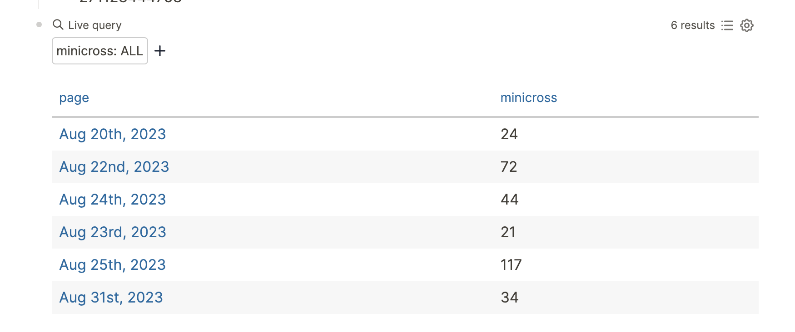
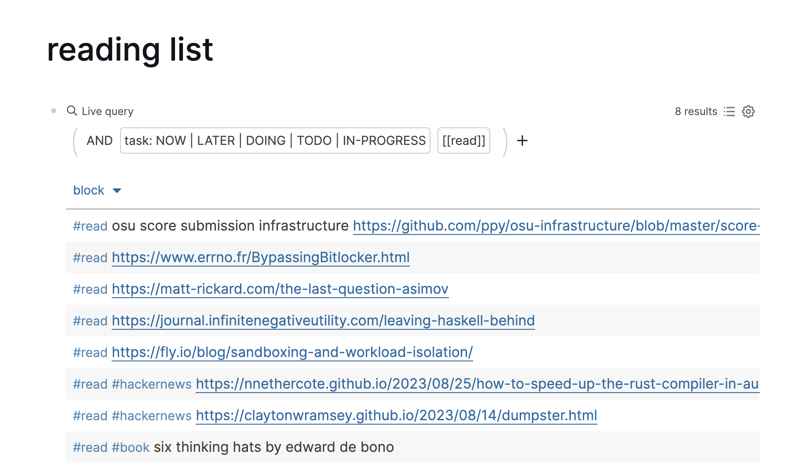

After working for quite a bit I like to catch up with some old friends from time
to time, when I made a surprising discovery -- many of them don't really use a
calendar of any sort to manage their lives. Tracking something that happens more
than a week into the future is generally out of the picture.

But I understand. Putting events into a calendar is kind of a chore. Calendars
that are [standards-compliant][3] are still primarily use email for the most part
(sending invites, updating times, etc.) and calendars that aren't
standards-compliant won't be compatible between different people unless they're
using the same service.

[3]: https://datatracker.ietf.org/doc/html/rfc5545

The personal management story has always been kind of fragmented. Calendars are
supposed to manage the entire picture of my personal schedule, yet they only see
a small slice without more information. The only things calendars can see
automatically with no intervention on my part are emails that happen to include
.ics files.

> I'm sure Google or Apple could probably ritz up their mail servers to scan text
> and try to see if there's events without there being an actual .ics file, but
> that's missing the point. The vast majority of people I associate with rarely
> sends email events anymore.

## Journals

For a while I've always wanted a kind of personal information manager: something
that would put all my information in one place and make it easy for me to query
across apps. When I embarked on this search I wouldn't have thought that the
most promising tool would end up being a journaling app.

(by journaling app I mean something like [Logseq], [Obsidian], [Notion],
[Workflowy] or [the][roam] [million][joplin] [other][craft]
[similar][stdnotes] [apps][bear] that allow you to write some markdown-ish
content, store it, and then never look back at it again)

[logseq]: https://logseq.com
[obsidian]: https://obsidian.md/
[notion]: https://www.notion.so/
[workflowy]: https://workflowy.com/
[roam]: https://roamresearch.com/
[joplin]: https://joplinapp.org/
[craft]: https://www.craft.do/
[stdnotes]: https://standardnotes.com/
[bear]: https://bear.app/

The world of journaling apps is vast but undiverse. Most of the apps just have
the same features others do, minus one or two gimmicks that makes it a ride or
die. But there's one important feature that I have started looking out for
recently: the ability to attach arbitrary metadata to journal entries and be
able to query for them.

I think the community is starting to realize that these journals are really just
databases, and extracting structured fields is extremely important if you want
any kind of smart understanding of what is being journaled.

[Logseq], the app that I've settled on, is backed by a [Datascript] store and
exposes a lot of this functionality to you as a user. It allows you to query
directly on properties that you write into your daily journal or any other page,
for example like this:

```
- ... other content ...
- minicross:: 34
- ... other content ...
```

I use this on my daily journals to track how long it takes me to do the [NY
Times daily crossword][minicross]. But Logseq is able to index this property in
particular and let me query on it later:

[datascript]: https://github.com/tonsky/datascript
[minicross]: https://www.nytimes.com/crosswords/game/mini



I can write todo items inline in my journal and find them all at a time as well.
As an example, here's all of the todo items that I've tagged specifically with
#read:



The fact that it truly is a database means I can start piling things in here and
automatically perform data extraction for a more complete picture of my daily
life. In the future I'd like to do dumps for my sleep and health data as well
and have Logseq be my ultimate source of truth.

I've also started developing a [calendar plugin for Logseq][2] that will have
the ability to display numerical data using various visualizations by using the
[D3] library.

[d3]: https://d3js.org/
[2]: https://git.mzhang.io/michael/logseq-calendar

## Privacy

Because people are dumping so much of their lives into journals, it's absolutely
crucial that boundaries are clear. Without control, this would be a dream come
true for any data collection company: rather than having to go out and gather
the data, users are entering and structuring it all by themselves.

End-to-end encryption is a feature that ensures data is never able to be
accessed by your storage or synchronization providers. Of course, end-to-end
encryption is [not possible unless the entire software is able to be scrutinized
by the user or community][1]. Do careful research before deciding who to trust
with your data.

[1]: /posts/2021-10-31-e2e-encryption-useless-without-client-freedom
