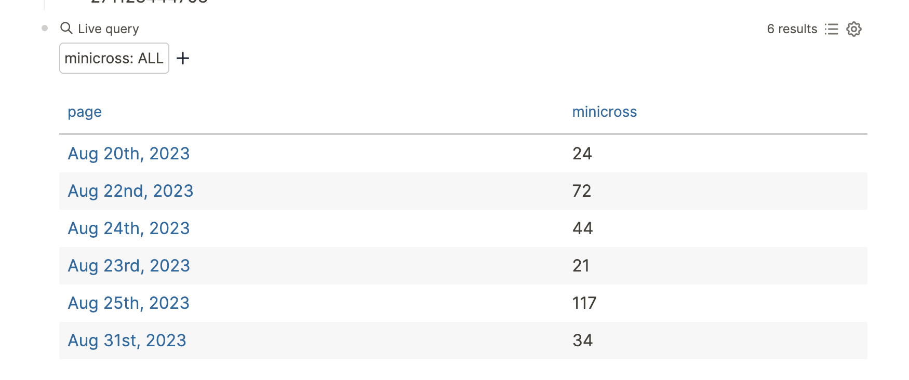

I'd occasionally catch up with some old friends every now and then, and over
time I made a surprising discovery -- many of them don't really use a calendar
of any sort to manage their lives. Tracking something that happens more than a
week into the future is generally out of the picture.

But I understand. Putting events into a calendar is kind of a chore. Traditional
calendar apps still primarily use email for the most part (sending invites,
updating times, etc.) and the new generation of calendar apps suffer from the
social network problem of having to get everyone on the same app.

The personal management story has always been kind of fragmented. Calendars are
supposed to manage the entire picture of my personal schedule, yet they only see
a small slice of your life. The only things calendars can see automatically with
no intervention on my part are emails that are sent from airlines.

> I'm sure Google or Apple could probably ritz up their services to scan text
> and guess events to put on your calendar, but that's missing the point. The vast
> majority of people I associate with rarely coordinate events over email in the
> first place.

## Journals

For a while I've always wanted a kind of personal information manager: something
that would put all my information in one place and make it easy for me to query
across apps. When I embarked on this search I wouldn't have thought that the
most promising tool would end up being a journaling app.

(by journaling app I mean something like [Logseq], [Obsidian], [Notion],
[Workflowy] or [the][roam] [million][joplin] [other][craft]
[similar][stdnotes] [apps][bear] that allow you to write some markdown-ish
content, store it, and then never look back at it again)

[logseq]: https://logseq.com
[obsidian]: https://obsidian.md/
[notion]: https://www.notion.so/
[workflowy]: https://workflowy.com/
[roam]: https://roamresearch.com/
[joplin]: https://joplinapp.org/
[craft]: https://www.craft.do/
[stdnotes]: https://standardnotes.com/
[bear]: https://bear.app/

The world of journaling apps is vast but relatively undiverse. Most of the apps
just have the same features others do, minus one or two gimmicks that makes it a
ride or die. But there's one important feature that I have started looking out
for recently: the ability to attach arbitrary metadata to journal entries and be
able to query for them.

While new apps have been cropping up from time to time for a while now, I think
something in common with the new ones these "journals" are really more like
personal databases, and extracting structured fields is extremely important if
you want any kind of smart understanding of what is being journaled.

For example, I could write "took the car in for repair today", but if I wanted
to find previous instances of this or make any kind of history, I would have to
essentially do a pure text search. However, with structured data this could be
different.

[Logseq], the app that I've settled on, is backed by a real database, and most
importantly exposes a lot of this functionality to you as a user. It allows you
to query directly on properties that you write into your daily journal or any
other page, for example like this:

What you're seeing is me using my daily journals to add a todo item for reading
a paper and tracking how long it takes me to do the [NY Times daily
crossword][minicross] (which I've shortened to minicross). I just add these to
my journal as it comes up throughout my day, but Logseq is able to index this
and serve it back to me in a very structured way:

[datascript]: https://github.com/tonsky/datascript
[minicross]: https://www.nytimes.com/crosswords/game/mini

With this, I could go on to construct a graph and see historical data of how I
did over time. You can see how this could be used for more personal tracking
things like workout records or grocery trackers.

The query tool is very simple and easy to learn, and makes it easy to actually
_use_ the information you wrote down, instead of just burying it into oblivion.
For example, I can write todo items inline in my journal and find them all at a
time as well. Here's all of the todo items that I've tagged specifically with
the tag `#read`:

Notice how the paper I added as a todo helpfully shows up here. No need for a
separate todo list or planning tool!

The fact that it truly is a database means I can just shove all kinds of
unrelated information into my journal, do some very trivial labeling and get
some really powerful uses out of it.

In the future I'd like to do dumps for my sleep and health data as well
and have Logseq be my ultimate source of truth. I've started developing a
[calendar plugin for Logseq][2] that will have the ability to display numerical
data using various visualizations for this purpose.

[2]: https://git.mzhang.io/michael/logseq-calendar

> Side note: this isn't sponsored in any way. While this post makes me sound
> like just a Logseq shill, it's actually quite the opposite; I've been donating
> to them monthly on [Open Collective] and they've been actively developing
> really cool features!

[open collective]: https://opencollective.com/logseq

## Privacy

Because people are dumping so much of their lives into journals, it's absolutely
crucial that boundaries are clear. Without control, this would be a dream come
true for any data collection company: rather than having to go out and gather
the data, users are entering and structuring it all by themselves.

**End-to-end encryption** is a technique that ensures data is never able to be
accessed by your storage or synchronization providers. If you are in the market
for some kind of personal tracking app, make sure it talks about end-to-end
encryption as a feature. While it's [not the end-all-be-all of security][1],
it's certainly a big first step. Do careful research before deciding who to
trust with your data.

[1]: /posts/2021-10-31-e2e-encryption-useless-without-client-freedom
