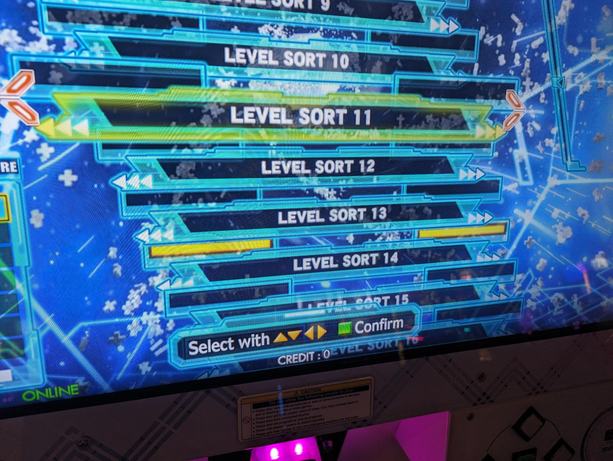

I'm a big fan of rhythm games.
Up til now, I've mainly been playing PC / mobile rhythm games such as osu!, Muse Dash, Project Sekai Colorful Stage, Arcaea, etc.
But since the pandemic has let up, I've been able to go to arcades more frequently and found myself climbing the levels in games like Chunithm, Sound Voltex, WACCA, and dance games like Dance Dance Revolution (DDR) and Pump it Up (PIU).
Since January of this year (2024), I have been going to the Dave and Buster's in Maple Grove pretty regularly to play DDR.

The game
---

Dance Dance Revolution certainly doesn't need any introduction, but I'm going to give one anyway.
It's a four-button vertical scrolling rhythm game produced by Konami's rhythm game division BEMANI.
Players step on the buttons to the music, matching arrows on the screen.

The game is conceptually very simple, but like all rhythm games, has a high difficulty ceiling.
Higher level charts are faster and introduce more technical moves such as crossovers.

Goals
---

One of the things I like about DDR is that there are numerous ways to enjoy it.
At a high level, here are some I want to share here:

- Playing for high level clears
- Playing for high accuracy clears
- Playing for completion
- Playing for unlocks
- Playing courses
- Playing doubles
- Playing for unofficial ranks

When I first started playing this game, all I knew was about pushing skill level, and that meant trying to go for as high of a level as I could clear.
As I pushed outside of my comfort zone for clears, I would get more and more tired, but the thrill from clearing high level charts was well worth the exhaustion.

Since DDR is still at its core a rhythm game, an important aspect of stepping on arrows is how _accurate_ the timing of your steps are.
Steps are graded on a scale from
    MISS,
    GOOD,
    GREAT,
    PERFECT, and
    MARVELOUS,
with a smaller hit window for the higher judgements.
Lamps are awarded for clearing charts with no lower judgements:

- No MISS = Full Combo (blue lamp)
- No GOOD or lower = Great Full Combo (green lamp)
- No GREAT or lower = Perfect Full Combo (gold lamp)
- No PERFECT or lower = Marvelous Full Combo (white lamp)

The coveted Marvelous Full Combo, or MFC for short, means you cleared the chart with a perfect score of 1,000,000.
The best part about trying to achieve these lamps is that there is no difficulty minimum for this: you can achieve lamps on _any_ chart of _any_ difficulty.

I've been playing around 16s lately, but for accuracy, I usually play around 9s to 11s in order to achieve high accuracy.
I just recently achieved my first Perfect Full Combo (PFC):

Not only are individual songs awarded lamps for completion, but entire folders are awarded lamps for the completion of all songs within it.
For example, to achieve the yellow clear lamp for the level 14 folder, I had to clear _all_ unlocked charts that were level 14:

This means that even if you get stuck at pushing high levels or high accuracy, you can still enjoy the game by clearing difficulties you already feel comfortable with while discovering some new songs.

Techs
---

Tools
---

[3icecream] is an indispensable tool when it comes to DDR.

[3icecream]: https://3icecream.com

Logistics
---

I primarily play at my local Dave and Busters, but I discovered that not all Dave and Busters locations have an online DDR machine.
For the Minneapolis area, the Discord has some pretty up-to-date info on where the locations of working cabs are, check the [zenius-i-vanisher] website.

[zenius-i-vanisher]: https://zenius-i-vanisher.com/v5.2/arcades.php

Also, Konami frequently performs maintenance on their servers, which means online capabilities like score saving will not be available.
Make sure to have these dates down.

Community
---

Wrap Up
---