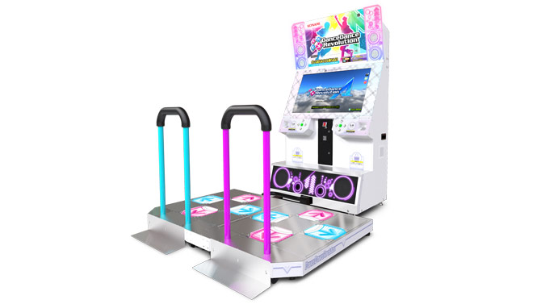
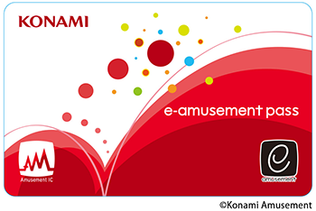
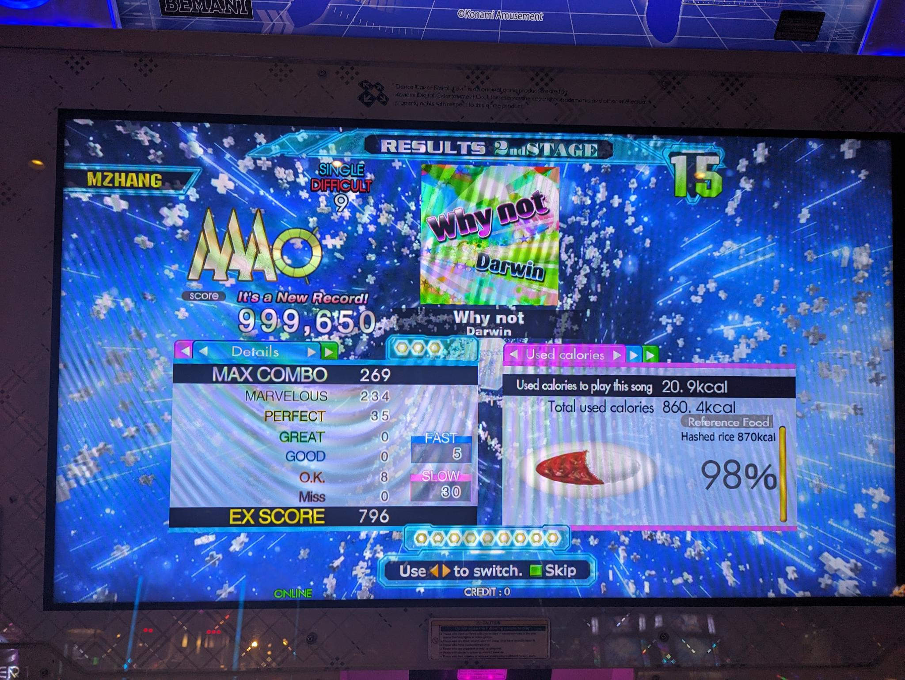
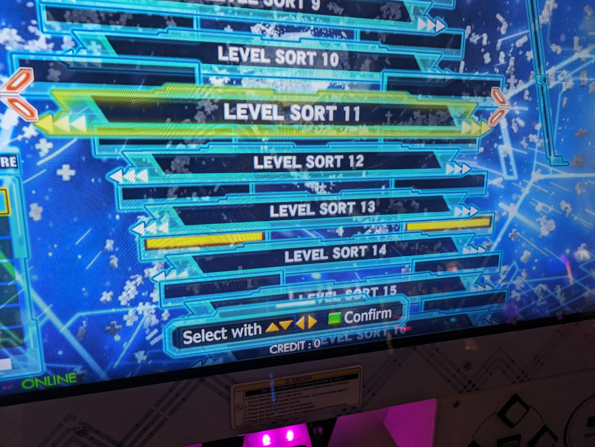

import { Image } from 'astro:assets';

I'm a huge fan of rhythm games.
Up til now, I've mainly been playing PC / mobile rhythm games such as [osu!], [Muse Dash], [Project Sekai], [Arcaea], etc.
But since the pandemic has let up, I've been able to go to arcades more frequently and found myself climbing the levels in games like [Chunithm], [Sound Voltex], [WACCA], and dance games like [Dance Dance Revolution (DDR)][DDR].

[osu!]: https://osu.ppy.sh/
[Muse Dash]: https://store.steampowered.com/app/774171/Muse_Dash/
[Project Sekai]: https://www.colorfulstage.com/
[Arcaea]: https://arcaea.lowiro.com
[Chunithm]: https://en.wikipedia.org/wiki/Chunithm
[Sound Voltex]: https://en.wikipedia.org/wiki/Sound_Voltex
[WACCA]: https://en.wikipedia.org/wiki/Wacca_(video_game)
[DDR]: https://en.wikipedia.org/wiki/Dance_Dance_Revolution

Since January of this year (2024), I have been going to the [Dave and Buster's in Maple Grove][2] pretty regularly to play DDR.
It's a great rhythm game that's been around for about as long as I've been alive, and it's also a nice workout.
I regularly hit more than 1,000 calories burned per session according to the in-game tracker.

[2]: https://www.daveandbusters.com/us/en/about/locations/maple-grove

Today I want to share some basics of how the game works as well as going more in-depth about some tips and tricks I've learned in the last 4 months or so of playing this game more seriously.
If you're considering getting started in DDR, please give this doc a read!

The game
---

The game itself certainly doesn't need any introduction, but I'm going to give one anyway.
It's a four-button vertical scrolling rhythm game produced by Konami's rhythm game division [BEMANI].
Players step on the buttons to the music, matching arrows on the screen.

[Bemani]: https://en.wikipedia.org/wiki/Bemani

The game is conceptually very simple, but like all rhythm games, has an incredibly high skill ceiling.
Just go on YouTube and search for DDR tournaments and you can see how insane some of the top players are.
Higher level charts are faster, introduce more technical moves, and have more gimmicky mechanics.

Logistics
---

I primarily play at my local Dave and Busters, but I discovered that not all Dave and Busters locations have an online DDR machine.
For the Minneapolis area, the Discord has some pretty up-to-date info on where the locations of working cabs are, check the [zenius-i-vanisher] website.

[MNDiscord]: https://discord.com/invite/bAQ9S9mRZp
[zenius-i-vanisher]: https://zenius-i-vanisher.com/v5.2/arcades.php

Although you could play on any cab, I've been looking for online cabs in particular.
The online cabs let you play with an _eAmusement Pass_, which comes with a lot of features I'm going to list below.
But unless you've got access to a Round 1 near you, these suckers are hard to find.
Your best bet is probably to order a card from online in that case.

Having one of these cards means:

- Saves scores across machines (**BIG**)
- Saves configuration settings
- You can unlock songs
- You don't have to skip the tutorial each time
- More granular scroll speed changes

You can also sign up for a paid course known as the "Basic" course.
This includes more features, but costs 330 yen and has a [more involved registration process][1].
This gives you:

[1]: https://3icecream.com/tutorial/add-basic-course-guide
- Ability to see score history (**BIG**)
- Ability to add rivals and see their scores live in game
- Darker in-game background
- Fast/slow indicators in game

The ability to see score history is big, because it means you can track your scores, which in my opinion is a big part of the self-improvement aspect of continuing to play this game.
In particular, being able to see improvement over time as well as tracking overall number of clears / full combo scores can help guide your song choices for future sessions.

Also, Konami frequently performs maintenance on their servers, which means online capabilities like score saving will not be available.
Make sure to have these dates down.

Gameplay
---

The most basic elements of DDR are:

- Arrows
- Freeze
- Jumps

Arrows are basically just simple steps. If it says to step on a button, then step on it.

import arrows from './arrows.png';

<Image src={arrows} alt="arrows" height="240" />

Freeze is the long green button. If it appears, hold it until the green track is over.
Unlike other rhythm games, holds do _not_ have release judgement.
This means it doesn't matter if you release it perfectly on time.

import freeze from './freeze.png';

<Image src={freeze} alt="freeze" height="240" />

Jumps are when two arrows occur at the same time.
It could also be an arrow and a freeze note.

import jumps from './jumps.png';

<Image src={jumps} alt="jumps" height="240" />

None of these concepts are too hard by themselves, but once you begin grouping them together, they can become incredibly difficult.

There's also a few charts with _shock arrows_, where if you're standing on any of the arrows, then it counts as a miss for the next couple notes.
These are rather unintuitive to play with initially, and I haven't really gotten the hang of it yet, so I assume it just gets easier with practice.

### Scroll Speed

The scroll speed of the arrows is calculated by the $\textrm{BPM} \times \textrm{Multiplier}$.
During song select, the BPM will be shown on the top near the title of the song.
The multiplier is something you set in the options menu, by pressing [9] at the song select screen.

When you're starting out, use this to determine your reading speed.
For example, if you're comfortable reading 2.0x on a 150 BPM song, that means your reading speed is around $2.0 \times 150 = 300$.
With this knowledge, when you see a 200 BPM song, you can divide $300 / 200 = 1.5$ to figure out that you need a 1.5x multiplier to read it comfortably.

Some tools like [3icecream] have a BPM calculator for charts if you enter in your reading speed, but often using your phone's calculator or just memorizing some common benchmark BPMs will do just fine.

> [!NOTE]
> Since every song you play might be a different BPM, always check to make sure the scroll speed is what you want!

If a song's BPM is variable, it will show a range instead.
**Be careful when you see this!**
This means the song may change BPM in the middle.
There's really no telling _how_ it will change before you play it, unless you look up the chart beforehand on something like [3icecream], which will tell you where all the BPM changes occur.

Generally when I see this, I treat the song as if it's whatever the higher end of that range will be.
For example, if it says 85~170, I'm going to assume it's 170 BPM.
This way, there's never a part that's too fast for me to read.

Unfortunately, for some extreme cases (usually on charts from older games), this will make the slow parts almost impossible to read.
That's just how the game works, so brush up on those slow scroll speed reading skills and hope you make it through this mess.

import mess from './mess.png';

<Image src={mess} alt="mess" height="240" />

There's also times when the chart will completely stop for a bit and continue.
Usually this is done to emphasize something in the song.
Other times it's just to mess with you.
Unfortunately, just like the BPM changes, there's not really a good way of knowing where the stops happen ahead of time, so either watch a video of the auto playthrough ahead of time, or just pray.
An example of a song with a lot of stops is [CHAOS][6].

[6]: https://ddr.stepcharts.com/SuperNOVA/CHAOS/single-challenge

Techs
---

Every rhythm game has its own technical moves, or "techs" as I call them.
These are patterns that are generally not as intuitive for new players, but are a skill developed over time.
Once you see how these work, you start seeing them in charts and begin incorporating the techniques into your normal gameplay.

In DDR, especially in earlier stages, you typically want to avoid "double stepping", which just means stepping on two arrows with the same foot in succession.
This is because it's not really fast, and you strain the foot and make it harder to step again quickly.
So most of these patterns make it easier to alternate feet in order to move faster.

Once you incorporate these techs into your gameplay, it'll be easier to make the judgement of whether or not to cross feet for the alternating, or to just double step.
Of course, there are scenarios where double stepping is required.
I've found myself in situations where I mispredicted the pattern, and a double step would've continued easier.
If you're having trouble with a section, you could always study the chart ahead of time and remember where the double step / crosses occur but generally this should be avoided.

**Crossovers.**
This pattern takes the form of left-down-right or left-up-right, but you'll see it in all different shapes and forms.
Whenever you see this pattern, you want to take the foot that's not in the middle and move it across to the other side.
For example, in the excerpt from [SUNKiSS♥DROP\~jun side\~ ESP][3] below, this entire pattern can be done by alternating feet.

[3]: https://ddr.stepcharts.com/SuperNOVA2/SUNKiSS-DROP~jun-Side~/single-expert

import crossover from './crossover.png';

<Image src={crossover} alt="crossover" height="240" />

**Scoobys.**
This pattern involves two sets of three notes going in the same direction but using different middle arrows.
If the middle is both up or both down, then this pattern doesn't work.
When you see this, you enter it just like a crossover, but use your other foot to hit the 4th note.
For example, in the excerpt from [Cirno's Perfect Math Class ESP][4] below, this entire pattern can be done by alternating feet.

[4]: https://ddr.stepcharts.com/A/Cirno's-Perfect-Math-Class/single-expert

import scooby from './scooby.png';

<Image src={scooby} alt="scooby" height="240" />

**Footswitches.**
This pattern usually shows up as repeated arrows (also known as "jacks").
However, instead of hitting them with the same foot, you can usually _switch_ off to the other foot on the same arrow.
For example, check out this excerpt from [Air Heroes ESP][5] below.
Like all the previous examples, this can be done completely by alternating.

[5]: https://ddr.stepcharts.com/2013/Air-Heroes/single-expert

import footswitch from './footswitch.png';

<Image src={footswitch} alt="footswitch" height="240" />

There's all sorts of more advanced crossovers that build on top of these and probably even more that I haven't encountered yet.
If there's anything you think that's worth mentioning here, let me know in the comments at the bottom of this page!

Goals
---

One of the things I like about DDR is all the different ways there are to enjoy it.
At a high level, here are some I want to share here:

- Playing for high level clears
- Playing for high accuracy clears
- Playing for completion
- Playing for unlocks
- Playing courses
- Playing doubles

When I first started playing this game, all I knew was pushing skill level, and that meant trying to go for as high of a level as I could clear.
As I pushed outside of my comfort zone for clears, I would get more and more tired, but the thrill from clearing high level charts was well worth the exhaustion.

Since DDR is still at its core a rhythm game, an important aspect of stepping on arrows is how _accurate_ the timing of your steps are.
Steps are graded on a scale from
    MISS,
    GOOD,
    GREAT,
    PERFECT, and
    MARVELOUS,
with a smaller hit window for the higher judgements.
Lamps are awarded for clearing charts with no lower judgements:

- No MISS = Full Combo (blue lamp)
- No GOOD or lower = Great Full Combo (green lamp)
- No GREAT or lower = Perfect Full Combo (gold lamp)
- No PERFECT or lower = Marvelous Full Combo (white lamp)

The coveted Marvelous Full Combo, or MFC for short, means you cleared the chart with a perfect score of 1,000,000.
The best part about trying to achieve these lamps is that there is no difficulty minimum for this: you can achieve lamps on _any_ chart of _any_ difficulty.

Even though I've been playing around 16s lately, but for accuracy, I usually play around 9s to 11s in order to achieve high accuracy.
The judgement windows don't change, but if the BPM is slower and there's less gimmicks, then you can usually get yourself into a rhythm and hit the notes on time.
For example, I just recently achieved my first Perfect Full Combo (PFC) on a level 9:

Taking this a step further, not only are individual songs awarded lamps for completion, but entire folders are awarded lamps for the completion of all songs within it.
For example, to achieve the yellow clear lamp for the level 14 folder, I had to clear _all_ unlocked charts that were level 14:

This means that even if you get stuck at pushing high levels or high accuracy, you can still enjoy the game by clearing difficulties you already feel comfortable with while discovering new songs.
Playing for completion really pushed me to explore the songs I didn't already know in this game.

Through playing with the premium mode, you can also unlock songs during the extra stage (assuming you collect the 9 dots required to unlock the stage).
If you play a song enough, you can unlock it permanently.
There's also a course system where you can opt to play preset selections of songs in a row without stopping.
Personally, I haven't put too much time into these yet, since I'm still so busy with the others.

There's also **doubles play**, which is a lot of fun.
This involves playing on _both_ dance pads at the same time, using all 8 arrows.
Each song is specifically charted to use both pads in doubles play.

In this mode, there's a lot of new moves that usually involve a variety of different kinds of crossovers.
This is a good way to practice using crossovers more liberally, and just to get in some more cardio.
I usually get in at least a game of doubles or two whenever I get the chance to have the machine for myself for a bit.

Tools
---

[3icecream] is an indispensable tool when it comes to DDR.
It has the following features:

[3icecream]: https://3icecream.com

- Scrapes your scores from Konami's website and displays them in listings
- Provides links to Youtube videos for charts
- Calculates relative chart difficulties based on user statistics for charts of the same level
- Exports all scores as CSV

In particular, the [difficulty list][7] is really helpful at finding "easy" charts.
If I'm going for level 17 clears, I'd usually scroll down to the bottom of the 17 list and see what songs people have generally gotten better scores on.
Even if you don't use the score tracking feature, I'd still recommend using this listing.

[7]: https://3icecream.com/difficulty_list/15

[Stepcharts] is another website that I've used to sort through and view charts when I'm not in front of a cab.
It's also where I produced all the chart images for this blog post.

[Stepcharts]: https://ddr.stepcharts.com/

[Life4] is an unofficial ranking system for personal growth.
I personally use this religiously as a way to motivate my improvement.
So far, up to gold, it's been covering a wide variety of skills (like high level clears, repeated stamina sets, low level accuracy) at a wide variety of skill levels.
If you're not sure which direction to improve, consider putting yourself on this ladder and going for the next rank!

[Life4]: https://life4ddr.com/

Wrap Up
---

That's it!
I learned a lot about this game not just from playing but also reading and talking with some folks online and offline.
There's an incredible wealth of information across the internet about this game, having been around for more than two decades now.
While I'm certainly not even close to the end of my journey with DDR, I hope that you got to learn something from my experience.

If there's something I got wrong, or some resources or information you want me to add, please let me know in the comments.
**See you next time on the dance floor!**