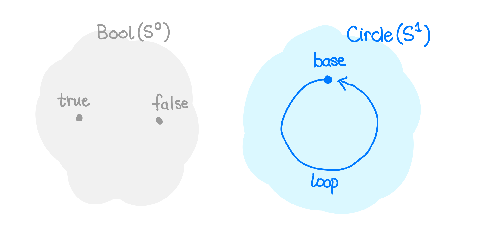
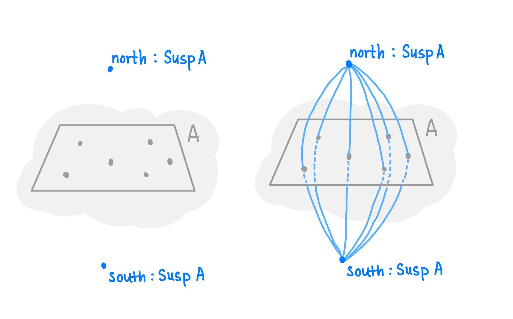
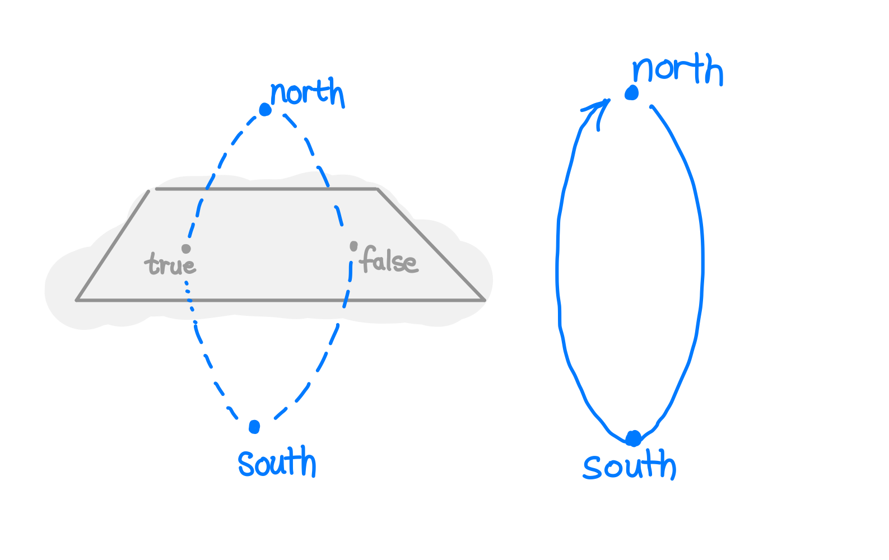

<details>
<summary>Imports</summary>

```
{-# OPTIONS --cubical --allow-unsolved-metas #-}
module 2024-09-15-circle-is-a-suspension-over-booleans.index where
open import Cubical.Core.Primitives
open import Cubical.Foundations.Prelude
open import Cubical.Foundations.GroupoidLaws
open import Cubical.Foundations.Isomorphism
open import Cubical.HITs.S1.Base
open import Data.Bool.Base hiding (_∧_; _∨_)
open import Data.Nat.Base
```

</details>

One of the simpler yet still very interesting space in algebraic topology is the **circle**.
Analytically, a circle can described as the set of all points that satisfy:

$$
x^2 + y^2 = 1
$$

Well, there are a lot more circles, like $x^2 + y^2 = 2$, and so on, but in topology land we don't really care.
All of them are equivalent up to continuous deformation.

What is interesting, though, is the fact that it can _not_ be deformed down to a single point at the origin.
It has the giant hole in the middle.

The circle, usually denoted $S^1$, is a special case of $n$-spheres.
For some dimension $n \in \mathbb{N}$, the $n$-sphere can be defined analytically as:

$$
\lVert \bm{x} \rVert_2 = \bm{1}
$$

where $\lVert \bm{x} \rVert_2$ is the [Euclidean norm][1] of a point $\bm{x}$.

[1]: https://en.wikipedia.org/wiki/Norm_(mathematics)

However, in the synthetic world, circles look a lot different.
We ditch the coordinate system and boil the circle down to its core components in terms of points and paths.
The 1-sphere $S^1$ is defined with:

$$
\begin{align*}
  \mathsf{base} &: S^1 \\
  \mathsf{loop} &: \mathsf{base} \equiv \mathsf{base}
\end{align*}
$$

What about the 2-sphere, aka what we normally think of as a sphere?
We can technically define it as a 2-path over the base point:

$$
\begin{align*}
  \mathsf{base} &: S^2 \\
  \mathsf{surf} &: \mathsf{refl}_\mathsf{base} \equiv_{\mathsf{base} \equiv \mathsf{base}} \mathsf{refl}_\mathsf{base}
\end{align*}
$$

It would be nice to have an iterative definition of spheres; one that doesn't rely on us using our intuition to form new ones.
Ideally, it would be a function $S^n : \mathbb{N} \rightarrow \mathcal{U}$, where we could plug in an $n$ of our choosing.

For an iterative definition, we'd like some kind of base case.
What's the base case of spheres?
What is a $0$-sphere?

If we take our original analytic definition of spheres and plug in $0$, we find out that this is just $| x | = 1$, which has two solutions: $-1$ and $1$.
The space of solutions is just a space with two elements!
In other words, the type of booleans is actually the $0$-sphere, $S^0$.



How about the iterative case? How can we take an $n$-sphere and get an $(n+1)$-sphere?
This is where we need something called a _suspension_.

Suspensions are a form of higher inductive type (HIT). It can be defined like this:

```
data Susp (A : Type) : Type where
  north : Susp A
  south : Susp A
  merid : A → north ≡ south
```

Intuitively, you take the entirety of the type $A$, and imagine it as some kind of plane.
Then, add two points, $\mathsf{north}$ and $\mathsf{south}$, to the top and bottom respectively.
Now, each original point in $A$ defines a _path_ between $\mathsf{north}$ and $\mathsf{south}$.



It may not be too obvious, but the circle $S^1$, can be represented as a suspension of the booleans $S^0$.
This is presented as Theorem 6.5.1 in the [HoTT book]. I'll go over it briefly here.

[hott book]: https://homotopytypetheory.org/book/

The main idea is to consider the paths generated by both the $\mathsf{true}$ and the $\mathsf{false}$ points to add up to a single $\mathsf{loop}$.
Here's a visual guide:



We can write functions going back and forth:

```
Σ2→S¹ : Susp Bool → S¹
Σ2→S¹ north = base -- map the north point to the base point
Σ2→S¹ south = base -- also map the south point to the base point
Σ2→S¹ (merid false i) = loop i -- for the path going through false, let's map this to the loop
Σ2→S¹ (merid true i) = base -- for the path going through true, let's map this to refl

S¹→Σ2 : S¹ → Susp Bool
S¹→Σ2 base = north
S¹→Σ2 (loop i) = (merid false ∙ sym (merid true)) i
```

Now, to finish showing the equivalence, we need to prove that these functions concatenate into the identity in both directions:

```
rightInv : section Σ2→S¹ S¹→Σ2
rightInv base = refl
rightInv (loop i) =
  -- Trying to prove that Σ2→S¹ (S¹→Σ2 loop) ≡ loop
  -- Σ2→S¹ (merid false ∙ sym (merid true)) ≡ loop

  -- Σ2→S¹ (merid false) = loop
  -- Σ2→S¹ (sym (merid true)) = refl_base
  cong (λ p → p i) (
    cong Σ2→S¹ (merid false ∙ sym (merid true)) ≡⟨ congFunct {x = merid false _} Σ2→S¹ refl refl ⟩
    loop ∙ refl ≡⟨ sym (rUnit loop) ⟩
    loop ∎
  )


leftInv : retract Σ2→S¹ S¹→Σ2
leftInv north = refl
leftInv south = merid true
leftInv (merid true i) j =
  -- i0 = north, i1 = merid true j (j = i0 => north, j = i1 => south)
  merid true (i ∧ j)
leftInv (merid false i) j =
  -- j = i0 ⊢ (merid false ∙ (λ i₁ → merid true (~ i₁))) i
  -- j = i1 ⊢ merid false i
  -- i = i0 ⊢ north
  -- i = i1 ⊢ merid true j

  -- (i, j) = (i0, i0) = north
  -- (i, j) = (i0, i1) = north
  -- (i, j) = (i1, i0) = merid true i0 = north
  -- (i, j) = (i1, i1) = merid true i1 = south
  let f = λ k → λ where
    (i = i0) → north
    (i = i1) → merid true (j ∨ ~ k)
    -- j = i0 ⊢ (merid false ∙ (λ i₁ → merid true (~ i₁))) i
    (j = i0) → compPath-filler (merid false) (sym (merid true)) k i
    (j = i1) → merid false i
  in hcomp f (merid false i)
```

And this gives us our equivalence!

```
-- Σ2≃S¹ : Susp Bool ≃ S¹
-- Σ2≃S¹ = isoToEquiv (iso Σ2→S¹ S¹→Σ2 rightInv leftInv)
```

In fact, we can also show that the $2$-sphere is the suspension of the $1$-sphere.
