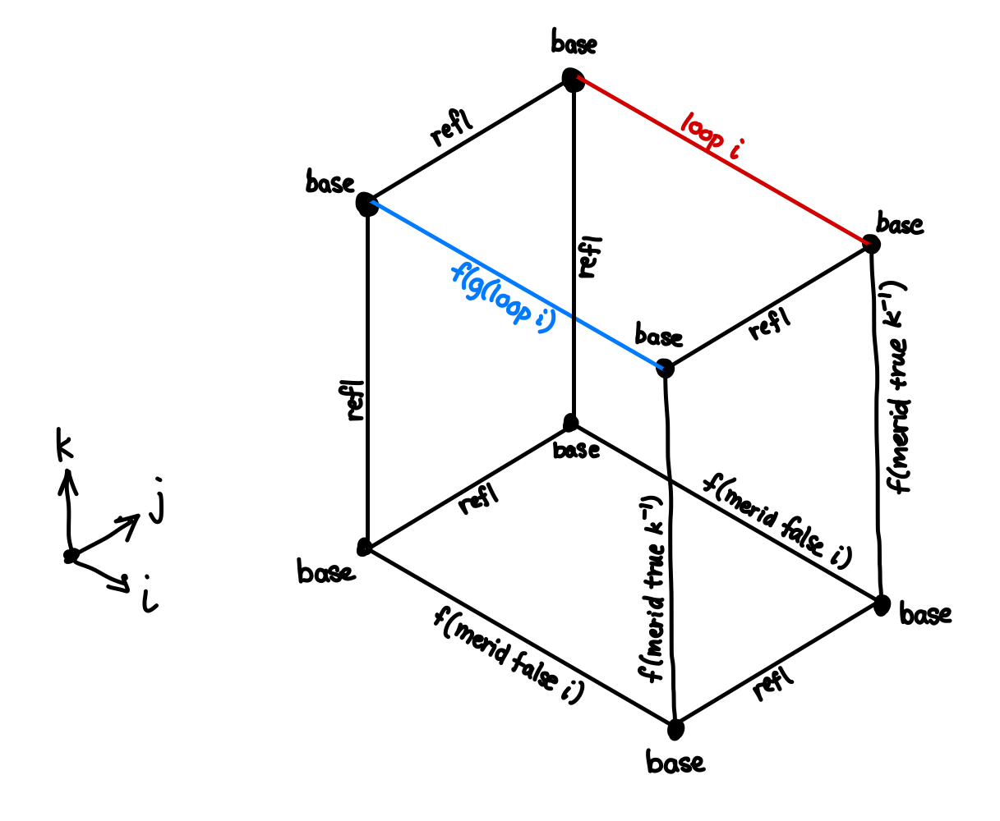

**hcomp** is a primitive operation in [cubical type theory][cchm] that completes the _lid_ of an incomplete cube, given the bottom face and some number of side faces.

[CCHM]: https://arxiv.org/abs/1611.02108

<details>
<summary>Imports</summary>

```
{-# OPTIONS --cubical #-}
module 2024-09-18-hcomp.index where
open import Cubical.Foundations.Prelude hiding (isProp→isSet)
open import Cubical.Foundations.Equiv.Base
open import Cubical.Foundations.Isomorphism
open import Cubical.Core.Primitives
open import Cubical.HITs.Susp.Base
open import Cubical.HITs.S1.Base
open import Data.Bool.Base hiding (_∧_; _∨_)
```

</details>

## Two-dimensional case

In two dimensions, hcomp can be understood as the double-composition operation.
"Single" composition (between two paths rather than three) is typically implemented as a double composition with the left leg as $\mathsf{refl}$.
Without the double composition, this looks like:


```
path-comp : {A : Type} {x y z : A} → x ≡ y → y ≡ z → x ≡ z
path-comp {x = x} p q i =
  let u = λ j → λ where
    (i = i0) → x
    (i = i1) → q j
  in hcomp u (p i)
```

The `(i = i0)` case in this case is $\mathsf{refl}_x(j)$ which is definitionally equal to $x$.

## Example: $\mathsf{isProp}(A) \rightarrow \mathsf{isSet}(A)$

Suppose we want to prove that all mere propositions (h-level 1) are sets (h-level 2).
This result exists in the cubical standard library, but let's go over it here.

```
isProp→isSet : {A : Type} → isProp A → isSet A
isProp→isSet {A} f = goal where
  goal : (x y : A) → (p q : x ≡ y) → p ≡ q
  goal x y p q j i = -- ...
```

We're given a type $A$, some proof that it's a mere proposition, let's call it $f : \mathsf{isProp}(A)$.

Now let's construct an hcomp. In a set, we'd want paths $p$ and $q$ between the same points $x$ and $y$ to be equal.
Suppose $p$ and $q$ operate over the same dimension, $i$.
If we want to find a path between $p$ and $q$, we'll want another dimension.
Let's call this $j$.
So essentially, the final goal is a square with these boundaries:


Our goal is to fill this square in.
Well, what is a square but a missing face in a 3-dimensional cube?
Let's draw out what this cube looks like, and then have $\mathsf{hcomp}$ give us the top face.
Before getting started, let's familiarize ourselves with the dimensions we're working with:

* $i$ is the left-right dimension, the one that $p$ and $q$ work over
* $j$ is the dimension of our final path between $p \equiv q$.
  Note that this is the first argument, because our top-level ask was $p \equiv q$.
* Let's introduce a dimension $k$ for doing our $\mathsf{hcomp}$


We can map both $p(i)$ and $q(i)$ down to a square that has $x$ on all corners and $\mathsf{refl}_x$ on all sides.

Let's start with the left and right faces $(i = \{ \mathsf{i0} , \mathsf{i1} \})$.
These can be produced using the proof $f : \mathsf{isProp}(A)$ that we are given.
$f$ tells us that $x$ and $y$ are the same, so $f(x, x) = x \equiv x$ and $f(x, y) = x \equiv y$.
This means we can define the left face as $f(x, x, k)$ and the right face as $f(x, y, k)$.
(Remember, $k$ is the direction going from bottom to top)


We can write this down as a mapping:

* $(i = \mathsf{i0}) \rightarrow f(x, x, k)$
* $(i = \mathsf{i1}) \rightarrow f(x, y, k)$

Since $k$ is only the bottom-to-top dimension, the front-to-back dimension isn't changing.
So we can use $\mathsf{refl}$ for those bottom edges.

The same logic applies to the front face $(j = \mathsf{i0})$ and back face $(j = \mathsf{i1})$.
We can use $\mathsf{isProp}$ to generate us some faces, except using $x$ and $p(i)$, or $x$ and $q(i)$ as the two endpoints.


This time, the $i$ dimension has the $\mathsf{refl}$ edges.
Since all the edges on the bottom face as $\mathsf{refl}$, we can just use the constant $\mathsf{refl}_{\mathsf{refl}_x}$ as the bottom face.
In cubical, this is the constant expression `x`.

Putting this all together, we can using $\mathsf{hcomp}$ to complete the top face $(k = \mathsf{i1})$ for us:

```
    let u = λ k → λ where
      (i = i0) → f x x k
      (i = i1) → f x y k
      (j = i0) → f x (p i) k
      (j = i1) → f x (q i) k
    in hcomp u x
```

Hooray! Agda is happy with this.

Let's move on to a more complicated example.

## Example: $\Sigma \mathbb{2} \simeq S^1$

Suspensions are an example of a higher inductive type.
It can be shown that spheres can be iteratively defined in terms of suspensions.


Since the $0$-sphere is just two points (solutions to $\| \bm{x} \|_2 = 1$ in 1 dimension), we represent this as $S^0 :\equiv 2$.
We can show that a suspension over this, $\Sigma 2$, is equivalent to the classic $1$-sphere, the circle $S^1$.

Let's state the lemma:

```
Σ2≃S¹ : Susp Bool ≃ S¹
```

Equivalences can be generated from isomorphisms:

```
Σ2≃S¹ = isoToEquiv (iso f g fg gf) where
```

In this model, we're going to define $f$ and $g$ by having both the north and south poles be squished into one side.
The choice of side is arbitrary, so I'll choose $\mathsf{true}$.
This way, $\mathsf{true}$ is suspended into the $\mathsf{refl}$ path, and $\mathsf{false}$ is suspended into the $\mathsf{loop}$.

Here's a picture of our function $f$:


The left setup is presented in the traditional suspension layout, with meridians going through $\mathsf{true}$ and $\mathsf{false}$ while the right side "squishes" the north and south poles using $\mathsf{refl}$, while having the other path represent the $\mathsf{loop}$.

On the other side, $g$, we want to map back from $S^1$ into $\Sigma 2$.
We can map the $\mathsf{loop}$ back into $\mathsf{merid} \; \mathsf{false}$, but the types mismatch, since $\mathsf{loop} : \mathsf{base} \equiv \mathsf{base}$ but $\mathsf{merid} \; \mathsf{false} : \mathsf{north} \equiv \mathsf{south}$.
But since $\mathsf{merid} \; \mathsf{true}$ is $\mathsf{refl}$, we can just concatenate with its inverse to get the full path:

$$
\mathsf{merid} \; \mathsf{false} \cdot (\mathsf{merid} \; \mathsf{true})^{-1} : \mathsf{north} \equiv \mathsf{north}
$$

In Agda, we can write it like this:

<div class="halfSplit">

```
  f : Susp Bool → S¹
  f north = base
  f south = base
  f (merid true i) = base
  f (merid false i) = loop i
```

```
  g : S¹ → Susp Bool
  g base = north
  g (loop i) = (merid false ∙ sym (merid true)) i
```

</div>

Now, the fun part is to show the extra requirements that is needed to show that these two functions indeed form an isomorphism.
Starting with the first, let's show $f(g(s)) \equiv s$.
The base case is easily handled by $\mathsf{refl}$, since $f(g(\mathsf{base})) = f(\mathsf{north}) = \mathsf{base}$ definitionally by the reduction rules we gave above.

```
  fg : (s : S¹) → f (g s) ≡ s
  fg base = refl
```

The loop case is trickier. If we were using book HoTT, here's how we would solve this (this result is given in Lemma 6.5.1 of the HoTT book):

$$
\begin{align*}
\mathsf{ap}_f(\mathsf{ap}_g(\mathsf{loop})) &\equiv \mathsf{loop} \\
\mathsf{ap}_f(\mathsf{merid} \; \mathsf{false} \cdot (\mathsf{merid} \; \mathsf{true})^{-1}) &\equiv \mathsf{loop} \\
\mathsf{ap}_f(\mathsf{merid} \; \mathsf{false}) \cdot \mathsf{ap}_f (\mathsf{merid} \; \mathsf{true})^{-1} &\equiv \mathsf{loop} \\
\mathsf{loop} \cdot \mathsf{ap}_f (\mathsf{merid} \; \mathsf{true})^{-1} &\equiv \mathsf{loop} \\
\mathsf{loop} \cdot \mathsf{refl}^{-1} &\equiv \mathsf{loop} \\
\mathsf{loop} \cdot \mathsf{refl} &\equiv \mathsf{loop} \\
\mathsf{loop} &\equiv \mathsf{loop} \\
\end{align*}
$$

Between the second and third steps, I used functoriality of the $\mathsf{ap}$ operation (equation _(i)_ of Lemma 2.2.2 in the HoTT book).

How can we construct a cube to solve this? Like in the first example, let's start out by writing down the face we want to end up with:


We're looking for the path in the bottom-to-top $j$ dimension.
We would like to have $\mathsf{hcomp}$ give us this face.
This time, let's see the whole cube first and then pick apart how it was constructed.



First of all, note that unrolling $f(g(\mathsf{loop} \; i))$ would give us $f((\mathsf{merid} \; \mathsf{false} \cdot (\mathsf{merid} \; \mathsf{true})^{-1}) \; i)$, which is the same as $f(\mathsf{merid} \; \mathsf{false} \; i) \cdot f(\mathsf{merid} \; \mathsf{true} \; (\sim i))$.
Since this is a composition, it deserves its own face of the cube, with our goal $f(g(\mathsf{loop} \; i))$ being the lid.

We can express this as an $\mathsf{hfill}$ operation, which is similar to $\mathsf{hcomp}$ in that it takes the same face arguments, but produces the contents of the face rather than just the upper lid.

For the rest of the faces, we can just fill in opposite sides until the cube is complete.
The Agda translation looks like this:

```
  fg (loop i) j =
    let
      u = λ k → λ where
        (i = i0) → base
        (i = i1) → f (merid true (~ k))
        (j = i0) →
          let u = λ k' → λ where
            (i = i0) → base
            (i = i1) → f (merid true (~ k'))
          in hfill u (inS (f (merid false i))) k
        (j = i1) → loop i
    in hcomp u (f (merid false i))
```

Nothing should be too surprising here, other than the use of a nested $\mathsf{hfill}$ which is needed to describe the face that contains the composition.

```
  gf : (b : Susp Bool) → g (f b) ≡ b
  gf north = refl
  gf south = merid true
    -- Both merid true and merid false work here... why pick true?
  gf (merid true i) j = merid true (i ∧ j)
```

For the last part, we are trying to prove:

`(merid false ∙ (λ i₁ → merid true (~ i₁))) i ≡ merid false i`

```
  gf (merid false i) j =
    let
      u = λ k → λ where
        (i = i0) → north
        (i = i1) → merid true (j ∨ ~ k)
        (j = i0) →
          let u = λ k' → λ where
            (i = i0) → north
            (i = i1) → merid true (~ k')
          in hfill u (inS (merid false i)) k
        (j = i1) → merid false i
    in hcomp u (merid false i)
```
